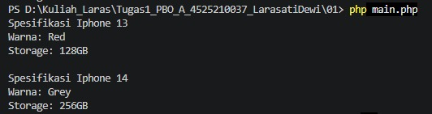
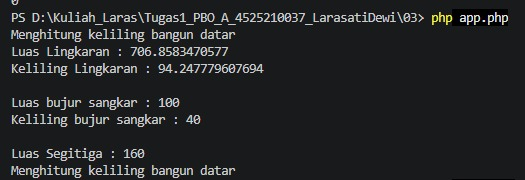
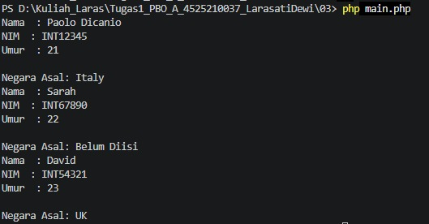
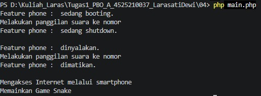
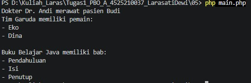
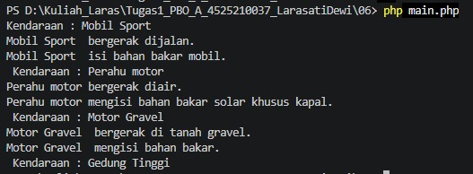

# Tugas PBO - Java ke PHP

Nama = Larasati Dewi
NPM = 4525210037

Repository ini berisi latihan **Pemrograman Berorientasi Objek (PBO)** dengan implementasi PHP.

## Struktur Folder

| Folder | Materi |
|---|---|
| `01` | Class dan Object: implementasi objek iPhone |
| `02` | Constructor, getter, setter, dan object Mahasiswa |
| `03` | Konsep dasar class/object dan beberapa latihan PBO |
| `04` | Inheritance (pewarisan) dengan `Handphone`, `Smartphone`, dan `FeaturePhone` |
| `05` | Association, Aggregation, dan Composition |
| `06` | Abstract Class dan Interface dengan `Vehicle`, `Car`, `Boat`, `Motor`, dan `Building` |

## Materi PBO

Beberapa konsep yang dipraktikkan dalam project ini:

- Class dan Object
- Constructor
- Encapsulation
- Getter dan Setter
- Inheritance
- Polymorphism
- Association
- Aggregation
- Composition
- Abstract Class
- Interface

## Hasil Program

1.  Class dan Object: implementasi objek iPhone 


2.  Constructor, getter, setter, dan object Mahasiswa



3.  Inheritance (pewarisan) dengan `Handphone`, `Smartphone`, dan `FeaturePhone` |




4.  Constructor, getter, setter, dan object Mahasiswa



5.  Association, Aggregation, dan Composition  



6.  Abstract Class dan Interface dengan `Vehicle`, `Car`, `Boat`, `Motor`, dan `Building`



## Cara Menjalankan

Masuk ke folder yang ingin dijalankan melalui terminal, kemudian gunakan:

```bash
php main.php
```

Contoh:

```bash
cd 06
php main.php
```

## Teknologi

- PHP 8.1
- Visual Studio Code
- Pemrograman Berorientasi Objek (PBO)
